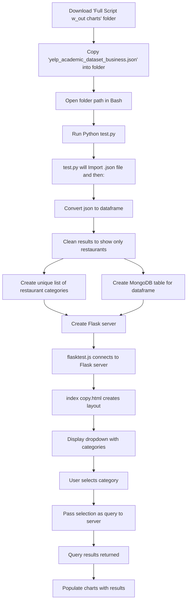

# Most Prevalent Restaurant Categories Across US Cities

## Project Overview
This project creates an interactive data visualization to showcase which cities have the most restaurants in various food categories. The goal is to provide insights into the cities with the highest volume of each restaurant category, focusing on user-friendly visualizations while efficiently managing restaurant data through a basic ETL (Extract, Transform, Load) pipeline.

## Dataset Links
Yelp Restaurant Data: https://www.yelp.com/dataset/download
SimpleMaps US Cities Data: (https://simplemaps.com/data/us-cities)

## Project Objectives
**Data Visualization:**  

Visualize the prevalence of restaurant categories by city.  

Enable users to explore trends through interactive visualizations.

**Key Features:**

Interactive User Interface: Dropdown menus for users to select specific restaurant categories and cities.  

Three Types of Visualizations:  

Choropleth Map: Displays restaurant density for a user-selected category.  

Bar Chart: Shows the top 10 cities based on the number of restaurants for the selected category.  

Bar Chart: Illustrates the top 10 restaurant categories in a user-selected city.  

## Ethical Considerations
We are committed to presenting data in an unbiased and fair manner, ensuring accurate and objective representation of restaurant categories and cities. Proper attribution will be given to all data sources and code references to maintain transparency and intellectual integrity. Throughout the project, we will adhere to ethical guidelines to prevent misuse of data, protect intellectual property rights, and ensure responsible handling of information. Clarity and accuracy in visualizations are prioritized to avoid potential misinterpretation.

## File Structure
flask.py: Contains the Flask application code for the backend.  

index.html: Main HTML file for the user interface.  

project.ipynb: Jupyter Notebook for exploratory data analysis and initial data processing.  

test.py: Python file to run the backend.  

chart4.html: HTML file for displaying the choropleth map visualization.  

chart4.js: JavaScript file that handles the choropleth map and its interactivity.  

Additional Backend: Used MongoDB as database.

## Steps to run

# 1
Add the original Yelp .json, 'yelp_academic_dataset_business.json', to the folder.
# 2
open folder in bash. run 'Python test.py'

## Install Mermaid extension to view

