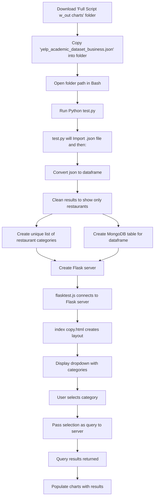

## Steps to run

# 1
Add the original Yelp .json, 'yelp_academic_dataset_business.json', to the folder.
# 2
open folder in bash. run 'Python test.py'

## Install Mermaid extension to view: I used Markdown Preview Mermaid Support. Upper right corner by the play button, one of those is an option to open preview.

